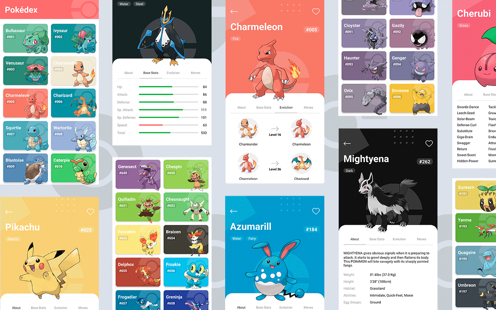
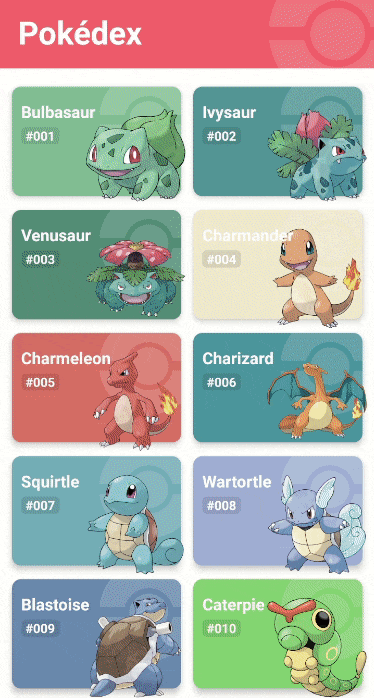

<div align="center">
  
</div>

***

<p align="center">Workshop of a small application with a modern and attractive design, based on Pokemon made with react native.</p>

<p align="center">
  🐞 <a href="https://github.com/DavidBarcenas/nextjs-plantpedia/issues">Report a Bug</a> 
  🙋‍♂️ <a href="https://github.com/DavidBarcenas/nextjs-plantpedia/issues">Request Feature</a>
</p>

# Preview



# Demo

<div align="center">
  
</div>

# Running the app
Clone/download the project and run `yarn install` to build the dependencies the project needs.

Install the React Native command line interface.
```
npm install -g react-native-cli
```

## Development

```
// Inside the downloaded folder

// To start Metro Bundler
npx react-native start

// Launch app on emulator or device
npx react-native run-android
npx react-native run-ios
```

# Credits

This project uses the [PokéAPI](https://pokeapi.co). to obtain all the information that is shown in the app.
<a href="https://pokeapi.co/)" align="right">
  
</a>

PokéAPI provides a RESTful API interface to highly detailed objects built from thousands of lines of data related to Pokémon.

# License
Released under the  [MIT licensed](LICENSE).\
Feel free to fork this project and improve it. Give a ⭐️ if you like this project!